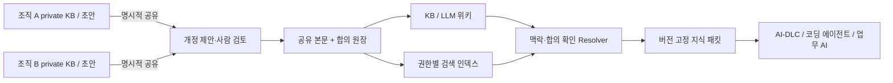

# Knowledger — 지식 합의 원장

[English](README.md)

**v0.8 개발 알파 · MIT · Node.js 24+**

각 조직이 자신의 지식과 기밀을 보유하면서, 공동 업무에 사용할 해석을 합의한다. 공유된 지식 문서는 **본문·개정·제안·합의 이력까지** 허가형 분산원장에 보관하고, KB/LLM 위키와 RAG는 이 정본에서 만든 조회·검색 화면으로 제공한다.

조직과 업무 도메인은 프로젝트 설정으로 정한다. 저장소에는 특정 산업이나 부서 구성을 필수로 넣지 않으며, `examples/order-workflow`는 여러 조직이 하나의 업무 흐름을 검토하는 선택형 예제다. 원장 합의가 의미의 진실성을 판단하지는 않는다.

## 바로 실행

프로젝트 설정을 만들고 빈 지식 작업 공간을 시작한다.

```sh
npm run config:init
npm start -- --config knowledger.config.json
```

기본 템플릿은 두 개의 예시 조직과 비어 있는 초기 문서 공간을 만든다. 조직·workspace·출력 경로는 반복 옵션으로 바꿀 수 있다.

```sh
npm run config:init -- --organization ExampleOneMSP --organization ExampleTwoMSP --workspace knowledge --output knowledger.config.json
npm start -- --config knowledger.config.json --data .data/knowledge --port 4317
npm run demo:web   # 선택형 order-workflow UI 예제
npm run demo:fabric # 선택형 3조직 Fabric 예제
npm run demo:login  # 선택형 개발 OIDC 로그인 예제
npm run demo        # UI 없이 order-workflow 승인/조회 흐름 실행
npm run check  # 도메인·API·저장소·adapter 테스트와 문서 계약 검사
```

`start:fabric`은 `demo:fabric`의 호환 별칭이고 `start:login`은 `demo:login`의 호환 별칭이다. 프로젝트 설정으로 실행하는 Fabric은 `--organization ORG_ID`가 필수이며, 선택한 조직의 인증 subject·peer·signer 참조만 연다. 설정 필드와 운영 경계는 [프로젝트 설정 가이드](docs/19-PROJECT-CONFIGURATION.md)에 정리했다.

기본 order-workflow 예제는 **가상 역할을 사용하는 단일 프로세스 로컬 모의 원장**이다. 실제 Fabric 네트워크와 조직 인증이 연결된 운영 서비스는 아니다. 같은 합의 엔진을 사용하는 [Fabric adapter](infra/fabric/README.md)는 별도 통합 경로이며, 현재 구현 범위와 검증 한계는 [실행 가이드](docs/11-RUNTIME.md)에 정리했다.

공유 본문과 비공개 초안은 별도 로컬 DB에 저장된다. 공개 확인 전에는 초안이 공유 검색·원장에 나타나지 않는다. 공개 후에는 참여 조직의 원장 사본에 남는다는 점을 검토해야 한다.

## 읽는 순서

| 문서 | 결정하는 내용 |
|---|---|
| [실행 가이드](docs/11-RUNTIME.md) | 빠른 시작, 가상 역할, 실제 동작하는 API, 구현 경계 |
| [구현 결정](docs/10-IMPLEMENTATION-DECISIONS.md) | 공통 TS 엔진, 로컬 체험, Fabric 통합의 선택 이유 |
| [제품 계약](docs/01-PRODUCT.md) | 사용자, 지식의 합의 단위, KB/LLM 위키 경험, MVP 범위 |
| [참조 아키텍처](docs/02-ARCHITECTURE.md) | 원장·부서 저장소·서명 게이트웨이·조회 계층·배포 모델 |
| [합의 프로토콜](docs/03-CONSENSUS.md) | 불변 개정본, 부서별 승인, 이견, 채택·철회·대체, 경쟁 상태 |
| [보안과 기밀](docs/04-SECURITY.md) | 공개 경계, 역할·키, 프롬프트 오염, 보존·복구 한계 |
| [맥락별 RAG](docs/05-RAG.md) | 검색·정본 확인·체크포인트·실행 manifest·철회 전파 |
| [API 계약](docs/06-API.md) | 명령/질의, 비동기 커밋, 멱등성, 오류·버전 규약 |
| [구현 단계와 검증](docs/07-DELIVERY-PLAN.md) | PoC→MVP→BFT 확장, 완료 기준, 성능 실험 |
| [전체 시나리오](docs/08-SCENARIOS.md) | 정상 흐름과 실패·경합·기밀·복구 사례 |
| [결정과 출처](docs/09-DECISIONS-AND-SOURCES.md) | 선택 이유, 대안, 미결 질문, 공식 참고 자료 |
| [프로젝트 설정](docs/19-PROJECT-CONFIGURATION.md) | 범용 workspace·조직 설정, 인증·signer·Fabric 참조, 호환성 |
| [계약 예제와 검사](tools/README.md) | JSON Schema, 예제, 구조·해시·참조 검증 범위 |

## 핵심 결정

- **문서 본문을 원장에 포함한다.** 공유된 Markdown 개정본은 전체 snapshot으로 저장한다. 문서 원본 서버가 사라져도 충분한 원장 이력과 피어 백업이 있으면 공유 지식을 복구할 수 있다.
- **부서와 bounded context를 동일시하지 않는다.** context 소유 관계와 부서 권한을 별도로 관리한다.
- **합의는 범위가 있다.** `(document, context, business scope, usage scope)`에 대해 채택한 정확한 개정본을 기록한다. 전사적 단일 정의나 LLM 다수결을 강제하지 않는다.
- **기밀은 배포 경계로 보호한다.** 조직별 비공개 원문은 private vault에 남기고 존재·해시도 자동 공개하지 않는다. 공용 channel의 과거 평문은 모든 channel 참여 피어에 복제된다.
- **검색은 파생 계층이다.** 벡터 유사도만으로 사용 권위를 정하지 않는다. context·접근 권한·합의·의존성·철회 상태를 별도로 확인한다.
- **기본 원장은 Hyperledger Fabric으로 채택했다.** 자체 분산 합의 알고리즘을 새로 만들지 않고 지식의 의미 합의와 도입 편의성에 집중한다. 참조 버전은 v3 계열이며 PoC는 3-orderer Raft(CFT), 악의적 orderer를 위협으로 포함할 때는 독립 관리의 4-orderer BFT 프로필을 별도 검증한다. 구체 patch/image digest는 네트워크 통합 시 고정한다.



## 소스 구조

| 경로 | 역할 |
|---|---|
| `packages/config` | workspace·조직·identity·정책·연결 참조 검증과 시작 템플릿 |
| `packages/domain` | 불변 문서·대표 승인·채택·철회·의존성·멱등성 규칙 |
| `packages/storage` | 로컬 journal, 시점별 projection, 비공개 초안·명령·manifest |
| `packages/fabric` | 같은 엔진을 사용하는 chaincode/Gateway 경계 |
| `apps/api` | 공개 미리보기, HTTP 명령, 검색·resolver·재검증 |
| `apps/web` | 설정 기반 검토함·문서·비공개 초안·실행 컨텍스트 |
| `test` | 행동·실패 경로·MVCC 모델 테스트 |
| `schemas`, `examples`, `docs` | 계약, 가상 데이터, 설계·운영 가이드 |

## 프로젝트 상태

구현된 범위와 확장 계획은 [로드맵](ROADMAP.md), 릴리스별 변경은 [변경 이력](CHANGELOG.md)에서 확인한다.

API와 UI는 실행 가능한 초기 알파다. 정책·조직 구성은 프로젝트 설정의 genesis에서 고정한다. [Fabric 웹 테스트 모드](docs/12-FABRIC-WEB.md)는 실제 원장과 영속 projection에 연결되며, [개발용 로그인](docs/13-DEVELOPMENT-LOGIN.md)은 OIDC 계정·별도 서명 서비스·권한 회수를 검증한다. [Markdown 가져오기](docs/14-MARKDOWN-IMPORT.md)로 로컬 KB 문서를 비공개 초안부터 검토할 수 있다. 실제 회사 SSO/KMS·조직별 운영, 모델 공급자별 transport와 벡터 검색 인덱스는 별도 배포·확장 범위다. [검증 기록](docs/VALIDATION.md)에 실제 실행 근거를 구분했다.

[내 비공개 초안](docs/15-PRIVATE-DRAFTS.md)에서 검토를 재개하고, [런타임 DB 백업·복원](docs/16-RUNTIME-BACKUP.md)으로 초안·원장 view·명령 기록을 새 데이터 폴더에 복구할 수 있다.

[조직별 개발 앱](docs/17-ORGANIZATION-RUNTIME.md)은 계정·서명 키·private 데이터 폴더를 조직 단위로 제한한다. 웹 화면은 [Claude 검토](docs/18-DESIGN-REVIEW.md)에 따라 검토함·영역 내비게이션·기술 증거 접기를 반영했다. 기준과 남은 조정 범위는 [DESIGN.md](DESIGN.md)에 있다.

[내 요청](docs/20-REQUEST-TRACKING.md)에서 미확정 거래를 이어서 확인하고 원래 명령으로 재시도한다.
[개정본 비교·브라우저 검사](docs/21-BROWSER-AND-REVISION-TESTS.md)와
[성능·장애 실험](docs/22-AUTOMATED-EXPERIMENTS.md)을 로컬과 CI에서 반복 실행할 수 있다.

[Claude 공동 리뷰](docs/25-CLAUDE-REVIEW.md)의 개정 이력 조회 비용, health 요청 제한,
원장 대기열·메모리 보관 구조, 저장소 가져오기·페이지 이동 문제를 수정하고 검증 근거를 기록했다.
[조회 참조 인덱스](docs/26-BROWSE-INDEX.md)는 검증된 공유 상태에서 페이지 후보를 고르고 선택된 원문만 읽는다.
[테스트 인증서 관리](docs/27-TEST-CERTIFICATES.md)는 만료 점검과 기존 키를 보존하는 갱신 절차를 제공한다.

## KB·모델 연결

[검토 대화·변경 영향](docs/31-REVIEW-WORKSPACE.md)은 앱 내 댓글·멘션·기한·반복 검토·수신자별 알림과 검증된 역방향 의존 조회를 지원한다. 문서 시작 템플릿과 검색 평가도 제공한다. 검토 완료는 사람의 합의 승인을 대체하지 않는다.

[선택한 댓글 전달](docs/33-REVIEW-DELIVERY.md)은 명시적 수신자 확인, 영속 재시도 큐와 별도 수신함을 제공한다. `npm run demo:review-delivery`로 응답 유실·중복 제거를 포함한 두 앱의 가상 연동을 실행할 수 있다.

[자동 기한 알림](docs/34-REVIEW-REMINDERS.md)은 현재 담당자에게 앱 내부 알림을 만들고 중복과 이전 일정의 알림을 제외한다.

[Markdown 저장소 연결](docs/23-KB-SOURCE-CONNECTOR.md)은 manifest에 지정한 파일만 비공개 초안으로 동기화한다.
[지식 클라이언트](docs/24-KNOWLEDGE-CLIENT.md)는 정확한 개정본과 합의 상태를 확인하고,
모델 생성 전과 결과 반환 전에 권한·최신성을 다시 검사한다.

```sh
npm run demo:kb
npm run kb:sync -- --server http://127.0.0.1:4317 --workspace knowledge --org OrgOneMSP --actor maintainer --root examples/markdown-kb --manifest examples/markdown-kb/manifest.json
```

`demo:kb`는 별도 임시 로컬 환경에서 허구의 담당자 승인과 모델 callback을 사용하는 실행 예제다.
`kb:sync`는 실행 중인 로컬 개발 앱에 비공개 초안을 만든다. OIDC 환경에서는 로그인한 웹 화면의 저장소 가져오기와 인증 transport를 주입한 SDK를 사용한다.

[MIT 라이선스](LICENSE)로 제공한다. [기여 가이드](CONTRIBUTING.md)와 [보안 안내](SECURITY.md)를 참고한다. 예제의 이름과 ID는 모두 가상이며 실제 인증정보가 없다.
