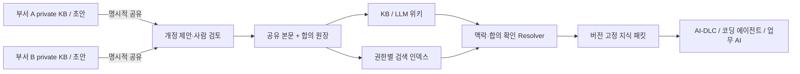

# Knowledge Consensus Ledger — 지식 합의 원장

**설계 초안 v0.1 · 2026-09-15 · 애플리케이션 구현 전**

각 도메인이 자신의 지식과 기밀을 보유하면서, 공동 업무에 사용할 해석을 합의한다. 공유된 지식 문서는 **본문·개정·제안·합의 이력까지** 허가형 분산원장에 보관하고, KB/LLM 위키와 RAG는 이 정본에서 만든 조회·검색 화면으로 제공한다.

같은 회사의 영업·물류·정산이 `주문 완료`를 다르게 정의해도 각 해석을 보존한다. `리뷰 요청은 배송 완료를 기준으로 한다`처럼 도메인 경계를 넘는 규칙만 필요한 책임자들이 합의한다. 원장 합의가 의미의 진실성을 판단하지는 않는다.

## 읽는 순서

| 문서 | 결정하는 내용 |
|---|---|
| [제품 계약](docs/01-PRODUCT.md) | 사용자, 지식의 합의 단위, KB/LLM 위키 경험, MVP 범위 |
| [참조 아키텍처](docs/02-ARCHITECTURE.md) | 원장·부서 저장소·서명 게이트웨이·조회 계층·배포 모델 |
| [합의 프로토콜](docs/03-CONSENSUS.md) | 불변 개정본, 부서별 승인, 이견, 채택·철회·대체, 경쟁 상태 |
| [보안과 기밀](docs/04-SECURITY.md) | 공개 경계, 역할·키, 프롬프트 오염, 보존·복구 한계 |
| [맥락별 RAG](docs/05-RAG.md) | 검색·정본 확인·체크포인트·실행 manifest·철회 전파 |
| [API 계약](docs/06-API.md) | 명령/질의, 비동기 커밋, 멱등성, 오류·버전 규약 |
| [구현 단계와 검증](docs/07-DELIVERY-PLAN.md) | PoC→MVP→BFT 확장, 완료 기준, 성능 실험 |
| [전체 시나리오](docs/08-SCENARIOS.md) | 정상 흐름과 실패·경합·기밀·복구 사례 |
| [결정과 출처](docs/09-DECISIONS-AND-SOURCES.md) | 선택 이유, 대안, 미결 질문, 공식 참고 자료 |
| [계약 예제와 검사](tools/README.md) | JSON Schema, 예제, 구조·해시·참조 검증 범위 |

## 핵심 결정

- **문서 본문을 원장에 포함한다.** 공유된 Markdown 개정본은 전체 snapshot으로 저장한다. 문서 원본 서버가 사라져도 충분한 원장 이력과 피어 백업이 있으면 공유 지식을 복구할 수 있다.
- **부서와 bounded context를 동일시하지 않는다.** context 소유 관계와 부서 권한을 별도로 관리한다.
- **합의는 범위가 있다.** `(document, context, business scope, usage scope)`에 대해 채택한 정확한 개정본을 기록한다. 전사적 단일 정의나 LLM 다수결을 강제하지 않는다.
- **기밀은 배포 경계로 보호한다.** 부서 비공개 원문은 private vault에 남기고 존재·해시도 자동 공개하지 않는다. 공용 channel의 과거 평문은 모든 channel 참여 피어에 복제된다.
- **검색은 파생 계층이다.** 벡터 유사도만으로 사용 권위를 정하지 않는다. context·접근 권한·합의·의존성·철회 상태를 별도로 확인한다.
- **참조 기반은 Fabric v3 계열이다.** PoC는 3-orderer Raft(CFT), 악의적 orderer를 위협으로 포함할 때는 독립 관리의 4-orderer BFT 프로필을 별도 검증한다. 구체 patch/image digest는 구현 착수 시 고정한다.



## 설계의 상태

이 폴더에는 설계 문서, 계약 schema, 예제와 로컬 구조 검사 도구가 있다. Fabric 네트워크·서명 게이트웨이·검색 서버·UI는 구현하거나 실행하지 않았다. 성능 목표는 실험용 기준이며 측정 결과가 아니다. 계약 검사 통과는 합의·암호서명·권한·분산 장애 동작의 검증을 뜻하지 않는다.

설계 검사는 외부 패키지 설치 없이 다음으로 실행한다.

```sh
python3 tools/validate_design.py
python3 tools/check_docs.py
```

실제 구현은 [구현 단계](docs/07-DELIVERY-PLAN.md)의 P0부터 진행한다. 예제의 이름과 ID는 모두 가상이며, 실제 인증정보가 없다.
