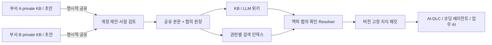

# Knowledge Consensus Ledger — 지식 합의 원장

**v0.1 개발 알파 · MIT · Node.js 24+**

각 도메인이 자신의 지식과 기밀을 보유하면서, 공동 업무에 사용할 해석을 합의한다. 공유된 지식 문서는 **본문·개정·제안·합의 이력까지** 허가형 분산원장에 보관하고, KB/LLM 위키와 RAG는 이 정본에서 만든 조회·검색 화면으로 제공한다.

같은 회사의 영업·물류·정산이 `주문 완료`를 다르게 정의해도 각 해석을 보존한다. `리뷰 요청은 배송 완료를 기준으로 한다`처럼 도메인 경계를 넘는 규칙만 필요한 책임자들이 합의한다. 원장 합의가 의미의 진실성을 판단하지는 않는다.

## 바로 실행

외부 패키지 설치 없이 로컬 워크스페이스를 실행할 수 있다.

```sh
npm start
```

`http://127.0.0.1:4317`을 열고 **물류 승인 → 정산 승인 → 리뷰 규칙 채택 → 지식 조회 → 철회**를 체험한다. Markdown 작성·공개 미리보기·개정 이력·맥락별 조회 화면을 포함한다.

```sh
npm run demo   # UI 없이 승인/조회/의존성 철회 흐름 실행
npm run check  # 도메인·API·저장소·adapter 테스트와 문서 계약 검사
```

기본 실행은 **가상 역할을 사용하는 단일 프로세스 로컬 모의 원장**이다. 실제 Fabric 네트워크와 조직 인증이 연결된 운영 서비스는 아니다. 같은 합의 엔진을 사용하는 [Fabric adapter](infra/fabric/README.md)는 별도 통합 경로이며, 현재 구현 범위와 검증 한계는 [실행 가이드](docs/11-RUNTIME.md)에 정리했다.

공유 본문과 비공개 초안은 별도 로컬 DB에 저장된다. 공개 확인 전에는 초안이 공유 검색·원장에 나타나지 않는다. 공개 후에는 참여 조직의 원장 사본에 남는다는 점을 검토해야 한다.

## 읽는 순서

| 문서 | 결정하는 내용 |
|---|---|
| [실행 가이드](docs/11-RUNTIME.md) | 빠른 시작, 가상 역할, 실제 동작하는 API, 구현 경계 |
| [구현 결정](docs/10-IMPLEMENTATION-DECISIONS.md) | 공통 TS 엔진, 로컬 체험, Fabric 통합의 선택 이유 |
| [제품 계약](docs/01-PRODUCT.md) | 사용자, 지식의 합의 단위, KB/LLM 위키 경험, MVP 범위 |
| [참조 아키텍처](docs/02-ARCHITECTURE.md) | 원장·부서 저장소·서명 게이트웨이·조회 계층·배포 모델 |
| [합의 프로토콜](docs/03-CONSENSUS.md) | 불변 개정본, 부서별 승인, 이견, 채택·철회·대체, 경쟁 상태 |
| [보안과 기밀](docs/04-SECURITY.md) | 공개 경계, 역할·키, 프롬프트 오염, 보존·복구 한계 |
| [맥락별 RAG](docs/05-RAG.md) | 검색·정본 확인·체크포인트·실행 manifest·철회 전파 |
| [API 계약](docs/06-API.md) | 명령/질의, 비동기 커밋, 멱등성, 오류·버전 규약 |
| [구현 단계와 검증](docs/07-DELIVERY-PLAN.md) | PoC→MVP→BFT 확장, 완료 기준, 성능 실험 |
| [전체 시나리오](docs/08-SCENARIOS.md) | 정상 흐름과 실패·경합·기밀·복구 사례 |
| [결정과 출처](docs/09-DECISIONS-AND-SOURCES.md) | 선택 이유, 대안, 미결 질문, 공식 참고 자료 |
| [계약 예제와 검사](tools/README.md) | JSON Schema, 예제, 구조·해시·참조 검증 범위 |

## 핵심 결정

- **문서 본문을 원장에 포함한다.** 공유된 Markdown 개정본은 전체 snapshot으로 저장한다. 문서 원본 서버가 사라져도 충분한 원장 이력과 피어 백업이 있으면 공유 지식을 복구할 수 있다.
- **부서와 bounded context를 동일시하지 않는다.** context 소유 관계와 부서 권한을 별도로 관리한다.
- **합의는 범위가 있다.** `(document, context, business scope, usage scope)`에 대해 채택한 정확한 개정본을 기록한다. 전사적 단일 정의나 LLM 다수결을 강제하지 않는다.
- **기밀은 배포 경계로 보호한다.** 부서 비공개 원문은 private vault에 남기고 존재·해시도 자동 공개하지 않는다. 공용 channel의 과거 평문은 모든 channel 참여 피어에 복제된다.
- **검색은 파생 계층이다.** 벡터 유사도만으로 사용 권위를 정하지 않는다. context·접근 권한·합의·의존성·철회 상태를 별도로 확인한다.
- **기본 원장은 Hyperledger Fabric으로 채택했다.** 자체 분산 합의 알고리즘을 새로 만들지 않고 지식의 의미 합의와 도입 편의성에 집중한다. 참조 버전은 v3 계열이며 PoC는 3-orderer Raft(CFT), 악의적 orderer를 위협으로 포함할 때는 독립 관리의 4-orderer BFT 프로필을 별도 검증한다. 구체 patch/image digest는 네트워크 통합 시 고정한다.



## 소스 구조

| 경로 | 역할 |
|---|---|
| `packages/domain` | 불변 문서·대표 승인·채택·철회·의존성·멱등성 규칙 |
| `packages/storage` | 로컬 journal, 시점별 projection, 비공개 초안·명령·manifest |
| `packages/fabric` | 같은 엔진을 사용하는 chaincode/Gateway 경계 |
| `apps/api` | 공개 미리보기, HTTP 명령, 검색·resolver·재검증 |
| `apps/web` | 가상 역할별 지식 검토 워크스페이스 |
| `test` | 행동·실패 경로·MVCC 모델 테스트 |
| `schemas`, `examples`, `docs` | 계약, 가상 데이터, 설계·운영 가이드 |

## 프로젝트 상태

API와 UI는 실행 가능한 초기 알파다. 정책·조직 구성은 genesis에서 고정한다. [Fabric 웹 테스트 모드](docs/12-FABRIC-WEB.md)는 실제 원장과 영속 projection에 연결되며, [개발용 로그인](docs/13-DEVELOPMENT-LOGIN.md)은 OIDC 계정·별도 서명 서비스·권한 회수를 검증한다. [Markdown 가져오기](docs/14-MARKDOWN-IMPORT.md)로 로컬 KB 문서를 비공개 초안부터 검토할 수 있다. 실제 회사 SSO/KMS·조직별 운영, 외부 모델·벡터 DB는 후속 단계다. [검증 기록](docs/VALIDATION.md)에 실제 실행 근거를 구분했다.

[내 비공개 초안](docs/15-PRIVATE-DRAFTS.md)에서 검토를 재개하고, [런타임 DB 백업·복원](docs/16-RUNTIME-BACKUP.md)으로 초안·원장 view·명령 기록을 새 데이터 폴더에 복구할 수 있다.

[조직별 개발 앱](docs/17-ORGANIZATION-RUNTIME.md)은 계정·서명 키·private 데이터 폴더를 조직 단위로 제한한다. 웹 디자인은 [Claude 검토](docs/18-DESIGN-REVIEW.md)를 바탕으로 [DESIGN.md](DESIGN.md)에 후속 방향을 정리했다.

[MIT 라이선스](LICENSE)로 제공한다. [기여 가이드](CONTRIBUTING.md)와 [보안 안내](SECURITY.md)를 참고한다. 예제의 이름과 ID는 모두 가상이며 실제 인증정보가 없다.
