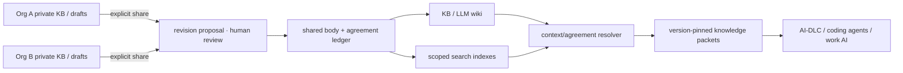

# Knowledger — Knowledge Consensus Ledger

[한국어](README.ko.md)

**v0.2 development alpha · MIT · Node.js 24+**

Each organization keeps its own knowledge and secrets while agreeing on the interpretations used for shared work. Shared knowledge documents — including body, revisions, proposals, and agreement history — are stored on a permissioned distributed ledger, and the KB/LLM wiki and RAG serve views derived from that canonical record.

Organizations and work domains come from project configuration. The repository ships no mandatory industry or department setup; `examples/order-workflow` is an optional example where several organizations review one workflow. Ledger consensus does not judge semantic truth.

## Run it

Create a project configuration and start an empty knowledge workspace.

```sh
npm run config:init
npm start -- --config knowledger.config.json
```

The default template creates two example organizations and an empty initial document space. Organizations, workspace, and output path are repeatable options.

```sh
npm run config:init -- --organization ExampleOneMSP --organization ExampleTwoMSP --workspace knowledge --output knowledger.config.json
npm start -- --config knowledger.config.json --data .data/knowledge --port 4317
npm run demo:web   # optional order-workflow UI example
npm run demo:fabric # optional 3-organization Fabric example
npm run demo:login  # optional development OIDC login example
npm run demo        # run the order-workflow approval/query flow without UI
npm run check  # domain, API, storage, adapter tests and document contract checks
```

`start:fabric` is a compatibility alias of `demo:fabric`, and `start:login` is an alias of `demo:login`. Running Fabric from a project configuration requires `--organization ORG_ID` and opens only the selected organization's certificate subject, peer, and signer references. Configuration fields and operating boundaries are in the [project configuration guide](docs/19-PROJECT-CONFIGURATION.md).

The default order-workflow example is a **single-process local simulated ledger with fictional roles** — not a production service wired to a real Fabric network and real organization certificates. The [Fabric adapter](infra/fabric/README.md) using the same agreement engine is a separate integration path; current scope and verification limits are documented in the [runtime guide](docs/11-RUNTIME.md).

Shared bodies and private drafts live in separate local databases. Drafts never appear in shared search or the ledger before explicit publication. After publication they persist in the ledger replicas of participating organizations — review that before sharing.

## Reading order

| Document | What it decides |
|---|---|
| [Runtime guide](docs/11-RUNTIME.md) | Quick start, fictional roles, working APIs, implementation boundaries |
| [Implementation decisions](docs/10-IMPLEMENTATION-DECISIONS.md) | Why a common TS engine, local experience, and Fabric integration |
| [Product contract](docs/01-PRODUCT.md) | Users, the unit of knowledge agreement, KB/LLM wiki experience, MVP scope |
| [Reference architecture](docs/02-ARCHITECTURE.md) | Ledger, department stores, signing gateway, query tier, deployment model |
| [Consensus protocol](docs/03-CONSENSUS.md) | Immutable revisions, per-department approval, disputes, adoption/withdrawal/supersession, contention |
| [Security and confidentiality](docs/04-SECURITY.md) | Disclosure boundaries, roles and keys, prompt contamination, retention/recovery limits |
| [Contextual RAG](docs/05-RAG.md) | Search, canonical verification, checkpoints, run manifests, withdrawal propagation |
| [API contract](docs/06-API.md) | Commands/queries, async commits, idempotency, error/version conventions |
| [Delivery plan and verification](docs/07-DELIVERY-PLAN.md) | PoC→MVP→BFT expansion, done criteria, performance experiments |
| [Scenarios](docs/08-SCENARIOS.md) | Happy paths plus failure, contention, confidentiality, recovery cases |
| [Decisions and sources](docs/09-DECISIONS-AND-SOURCES.md) | Rationale, alternatives, open questions, official references |
| [Project configuration](docs/19-PROJECT-CONFIGURATION.md) | Generic workspace/org config, auth, signer, Fabric references, compatibility |
| [Contract examples and checks](tools/README.md) | JSON Schema, examples, structure/hash/reference validation scope |

## Key decisions

- **Document bodies go on the ledger.** Shared Markdown revisions are stored as full snapshots. If the source server disappears, sufficient ledger history and peer backups can recover shared knowledge.
- **Departments are not bounded contexts.** Context ownership and department authority are managed separately.
- **Agreement is scoped.** It records the exact revision adopted for `(document, context, business scope, usage scope)`. No forced enterprise-wide single definition or LLM majority vote.
- **Confidentiality is protected by deployment boundaries.** Per-organization private sources stay in private vaults; their existence and hashes are not auto-disclosed. Past plaintext on a shared channel replicates to all participating peers.
- **Search is a derived tier.** Vector similarity alone never grants usage authority; context, access rights, agreement, dependency, and withdrawal status are checked separately.
- **Hyperledger Fabric is the default ledger.** No new distributed consensus algorithm — the project focuses on semantic agreement and adoption. Reference version is v3; the PoC uses 3-orderer Raft (CFT), and a 4-orderer BFT profile under independent administration is validated separately when malicious orderers are in scope. Patch/image digests are pinned at network-integration time.



## Source layout

| Path | Role |
|---|---|
| `packages/config` | Workspace, org, identity, policy, connection reference validation and starter templates |
| `packages/domain` | Immutable documents, representative approval, adoption, withdrawal, dependencies, idempotency rules |
| `packages/storage` | Local journal, point-in-time projections, private drafts, commands, manifests |
| `packages/fabric` | Chaincode/Gateway boundary using the same engine |
| `apps/api` | Public preview, HTTP commands, search, resolver, re-verification |
| `apps/web` | Config-driven review inbox, documents, private drafts, run context |
| `test` | Behavior, failure-path, and MVCC model tests |
| `schemas`, `examples`, `docs` | Contracts, fictional data, design/operations guides |

## Project status

Implemented scope and planned extensions are tracked in the [roadmap](ROADMAP.md);
release changes are recorded in the [changelog](CHANGELOG.md).

API and UI are a runnable early alpha. Policies and org composition are fixed in the project configuration genesis. [Fabric web test mode](docs/12-FABRIC-WEB.md) connects to a real ledger with persistent projection; [development login](docs/13-DEVELOPMENT-LOGIN.md) verifies OIDC accounts, a separate signing service, and permission revocation. [Markdown import](docs/14-MARKDOWN-IMPORT.md) lets you review local KB documents starting from private drafts. Real corporate SSO/KMS, per-organization operations, per-model-provider transports, and vector search indexes are separate deployment/extension scope. Actual run evidence is separated in the [validation record](docs/VALIDATION.md).

Resume review in [my private drafts](docs/15-PRIVATE-DRAFTS.md), and restore drafts, ledger views, and command records into a new data folder with [runtime DB backup/restore](docs/16-RUNTIME-BACKUP.md).

[Per-organization development apps](docs/17-ORGANIZATION-RUNTIME.md) bound accounts, signing keys, and private data folders to one organization. The web UI reflects the [Claude review](docs/18-DESIGN-REVIEW.md): review inbox, area navigation, collapsible technical evidence. Baseline and remaining adjustments live in [DESIGN.md](DESIGN.md).

[My requests](docs/20-REQUEST-TRACKING.md) resumes unconfirmed transactions and retries the original command.
[Revision diff and browser checks](docs/21-BROWSER-AND-REVISION-TESTS.md) and
[performance/failure experiments](docs/22-AUTOMATED-EXPERIMENTS.md) run repeatedly locally and in CI.

The [Claude joint review](docs/25-CLAUDE-REVIEW.md) fixes cover revision-history lookup cost, health-request limits,
ledger-wait and private-job memory structure, and repository import/page navigation issues — with verification evidence recorded.
The [browse reference index](docs/26-BROWSE-INDEX.md) picks page candidates from verified shared state and reads only the selected canonical values.
[Test certificate management](docs/27-TEST-CERTIFICATES.md) provides expiry checks and a renewal procedure that preserves existing keys.

## KB and model integration

[Markdown repository connector](docs/23-KB-SOURCE-CONNECTOR.md) syncs only manifest-listed files into private drafts.
The [knowledge client](docs/24-KNOWLEDGE-CLIENT.md) verifies the exact revision and agreement state,
and re-checks authorization and freshness before model generation and before returning results.

```sh
npm run demo:kb
npm run kb:sync -- --server http://127.0.0.1:4317 --workspace knowledge --org OrgOneMSP --actor maintainer --root examples/markdown-kb --manifest examples/markdown-kb/manifest.json
```

`demo:kb` is a runnable example using fictional approver sign-off and a model callback in an isolated local environment.
`kb:sync` creates private drafts in a running local development app. Under OIDC, use the signed-in web UI's repository import and an SDK with an injected authenticated transport.

Provided under the [MIT license](LICENSE). See the [contribution guide](CONTRIBUTING.md) and [security notes](SECURITY.md). All example names and IDs are fictional and contain no real credentials.
