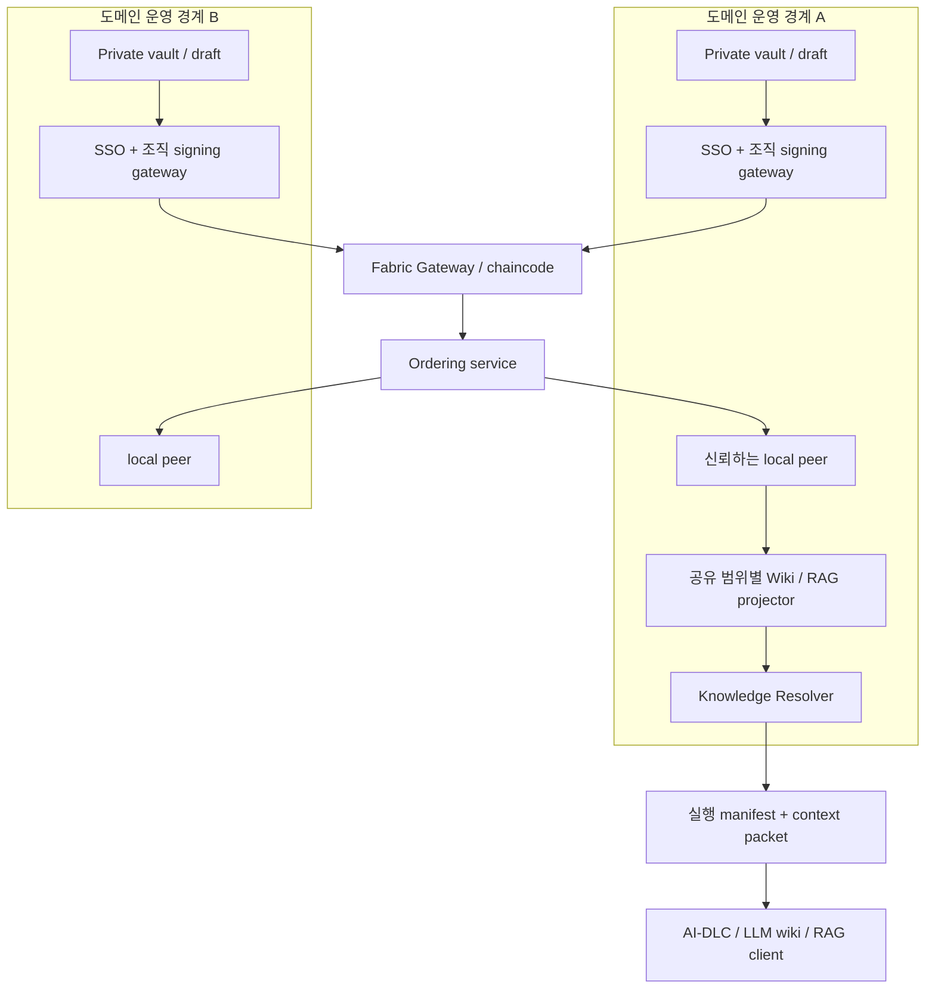

# 02. 참조 아키텍처

## 데이터와 권한의 경계

이 설계의 공유 문서는 **본문이 원장에 있는 문서**다. 해시만 기록하는 기능으로 축소하지 않는다. 반면 부서 기밀은 공용 channel에 본문을 올리지 않는다. 두 종류가 동일 저장 정책을 갖는다고 가정하지 않는다.

| 영역 | 정본 | 누가 본문을 보유하는가 | 보존 의미 |
|---|---|---|---|
| Private draft / vault | 부서 저장소 | 해당 부서가 허용한 주체 | 부서 보존·삭제 정책 |
| Shared knowledge | 공유 Fabric channel의 VALID 거래와 상태 | channel 피어/인가된 orderer 운영 경계 | 게시된 개정 이력 보존 |
| Restricted shared (후속 단계) | 고정된 하위 그룹의 별도 channel | 그 channel 참여자 | 그룹별 별도 보존 |
| Wiki / KB view | 원장에서 파생된 PostgreSQL read model | 해당 공유 범위 내 서비스 | 재구축 가능 |
| RAG index / cache | 파생 데이터 | 해당 지식 범위가 허용한 인덱서 | 권한·합의 변경 시 무효화 |
| Run context manifest | 실행 조직의 로컬 감사 저장소 | 실행 조직의 허용 주체 | 제공한 지식의 기록; LLM 이해 증명 아님 |

Private Data Collection(PDC)은 공통 블록에 전문을 넣지 않고 인가된 피어에 별도로 payload를 전파한다. **공용 원장만으로 private payload를 재구축할 수 없으므로** v1 공유 문서의 저장 약속으로 사용하지 않는다. 제한 그룹은 v1.1 이후 별도 channel을 우선 평가한다. PDC는 별도 보존·백업 계약을 수립한 뒤 비교한다. [공식 구분](https://hyperledger-fabric.readthedocs.io/en/latest/private-data/private-data.html)

## 구성 요소

- **Knowledge API**: 요청 인증·크기 제한·명령 멱등성·공유 전 검토와 커밋 추적. domain data를 자동으로 전사 수집하지 않는다.
- **조직 signing gateway**: 부서가 통제하는 키로 요청을 인증한다. human approval UI의 명시적 선택과 역할을 조직이 확인해 서명한다. AI에 승인 키를 제공하지 않는다.
- **Chaincode**: 문서 개정 검증, business approval 상태, active slot CAS, 정책/멤버십 epoch, 의존성, 멱등성 레코드. 의미 분석·임베딩·외부 URL 호출을 하지 않는다.
- **Ordering service**: 거래 순서를 정한다. 문서 의미의 옳고 그름이나 업무 승인 자체를 결정하지 않는다.
- **Peer**: 정책에 따라 endorse하고 블록의 거래 유효성을 검증·커밋한다. 앱은 orderer 수신 ACK가 아니라 신뢰하는 peer의 `VALID` 커밋을 확인한다.
- **Projector**: 신뢰하는 local peer의 full block에서 커밋된 VALID 거래의 read/write set을 `(channel, block, tx index)` 순서로 적용한다. 위키, 검색, 역의존성, 변경 feed를 만든다. invalid 거래는 상태에 반영하지 않지만 블록 payload에서 사라지는 것은 아니다.
- **Resolver**: 후보 검색 결과를 원장 기준으로 다시 해석하고 권한·scope·활성 상태를 확인한다.

## 기술 선택

| 영역 | 참조 선택 | 이유와 경계 |
|---|---|---|
| 공유 원장 | Hyperledger Fabric v3 계열 | 조직 identity·endorsement·channel·full payload·BFT 선택 가능 |
| Ledger adapter / chaincode | Go | Fabric SDK/chaincode 경계와 결정적 검증에 집중 |
| 사용자 API / projector | TypeScript service | UI·KB adapter·MCP/HTTP 연동 편의; ledger mutation은 adapter를 통해 수행 |
| Wiki / 검색 read model | PostgreSQL + pgvector | 일반 조회·context/권한 필터·벡터 후보 검색을 한 저장소에서 시작 |
| 기밀/첨부 | 부서가 관리하는 기존 Git 또는 암호화 객체 저장소 | 공급자 종속을 최소화하고 원문 소유 유지 |
| UI | 가벼운 웹 UI | 본문 diff, 승인 scope, 이견, 근거, 공유 범위를 한 화면에서 확인 |
| 이벤트 전달 | Fabric event stream + durable outbox | 외부 broker를 처음부터 추가하지 않음 |

구현 시 정확한 Fabric patch, CA/Gateway/chaincode SDK, PostgreSQL/pgvector 호환 버전을 고정한다. 여기의 선택은 설치·운영 검증을 마친 BOM이 아니다. 실제 dependency와 이미지 digest는 P0에서 확정한다.

## 합의와 신뢰 프로필

| 프로필 | 구성 | 허용하는 보증 | 보증하지 않는 것 |
|---|---|---|---|
| 로컬 설계 데모 | 한 개발 머신, 역할 분리 | 프로토콜·API 흐름 확인 | 운영 독립성·고가용성 |
| CFT PoC | 3 Raft orderer + 도메인별 peer | 신뢰하는 orderer 중 1개 crash 중에도 순서화 가능 | 악의적인 orderer에 대한 보호 |
| BFT 목표 프로필 | 최소 4 SmartBFT orderer, 독립 관리 경계 | 정해진 가정에서 1개 Byzantine orderer에 대한 순서화 보호 | CA·signing gateway·local peer·RAG server·사람의 악의까지 자동 보호 |

Fabric BFT는 v3.0부터 제공되며 orderer의 1/3 미만 장애를 가정한다. 3개 노드가 1개 악성 노드를 견딘다고 주장하지 않는다. [Ordering Service](https://hyperledger-fabric.readthedocs.io/en/latest/orderer/ordering_service.html)

PoC의 사업상 도메인 책임자는 영업·물류·정산이며, BFT 프로필의 네 번째 운영 주체는 별도 플랫폼/감사 운영 경계로 둘 수 있다. 노드 4개를 같은 관리자 키·같은 슈퍼 관리자 계정이 통제하면 독립 관리 프로필이 아니다. 법적 회사가 같더라도 역할 분리는 유용하지만 전사 최상위 관리자 전체의 담합을 막는다고 주장하지 않는다.

## 상태의 정본과 재구축

원장은 전체 공유 문서 개정본과 agreement/policy/membership 사건을 담는다. PostgreSQL은 정본이 아니다. read model을 삭제하면 channel의 보존된 이력에서 다시 만든다. Fabric current world state도 블록 이력으로부터 재구축하는 구조다. [Ledger](https://hyperledger-fabric.readthedocs.io/en/latest/ledger/ledger.html)

- 이벤트 처리 키: `(channel_id, block_number, transaction_index, event_index)`; cursor에 block hash와 projector schema version을 결속한다.
- 각 channel의 projection cursor와 적용 결과를 같은 DB transaction으로 기록한다.
- 문서 내용 hash와 projection의 결과를 주기적으로 대조한다.
- snapshot bootstrap만으로 과거 본문/합의 이력이 모두 복원된다고 가정하지 않는다. full-history 복제·backup을 별도로 유지한다.
- 본문이 여러 peer에 있다고 영구 보존이 보장되지 않는다. 노드·백업·복구 절차를 실제로 검증해야 한다.

## Projection의 완전성 계약

정합성의 입력은 chaincode event 알림이 아니라 **검증된 full transaction의 KV write set**이다. 지원하는 chaincode namespace와 versioned key prefix(`revision`, `proposal`, `decision`, `review_counter`, `agreement`, `active_slot`, `policy`, `role_binding`, `entitlement`, `eligibility_epoch`, `publication_gate`, `idempotency`, `fence`)를 reducer가 명시적으로 이해해야 한다. 각 write value는 버전이 있는 canonical JSON이다.

VALID tx의 모든 write/delete와 temporal interval 갱신을 하나의 projection DB transaction으로 적용한 뒤에만 cursor를 전진시킨다. unknown key prefix/schema, 누락된 full tx payload, 해시 불일치, revision 불변성 위반이면 중단한다. INVALID tx는 상태 변경 없이 위치를 진행할 수 있다. chaincode events는 알림 최적화이며 유실돼도 write-set replay로 정확성을 유지한다. 단순 event 구독만으로 full replay가 가능하다고 주장하지 않는다.

이미 통과한 tx 이후의 cursor만 기록해서 동작을 건너뛰지 않도록 block hash+tx index+reducer version을 보관하고, 동일 입력을 재적용해도 결과가 같은 reducer로 만든다. 새 chaincode key/schema를 쓰기 전에 reader를 배포한다.

## 검색의 최신성과 비용

저비용 탐색은 파생 인덱스를 사용한다. 규범적 context packet 발급에는 [RAG 설계](05-RAG.md)의 명시적인 체크포인트를 사용한다. MVP는 전체 workspace의 `eligibility_epoch`를 사용해 보수적으로 무효화한다. 서로 무관한 지식 변경에도 재확인이 발생할 수 있다. per-context epoch 최적화는 정확성 측정 뒤 수행한다.

## 배포/장애 경계

클라이언트·부서별 signing gateway·local peer는 서로 다른 신뢰 경계다. PoC에서는 한 환경에 배포할 수 있으나 운영 독립성이 검증됐다고 표현하지 않는다. 데이터 저장·검색 노드는 channel별로 분리하고 다른 채널의 결과 수·제목·벡터도 혼합하지 않는다. 원장 불가 시 private drafting과 명시적 historical 조회는 가능하지만 새로운 공동 채택이나 strict context 발급은 중단한다.
