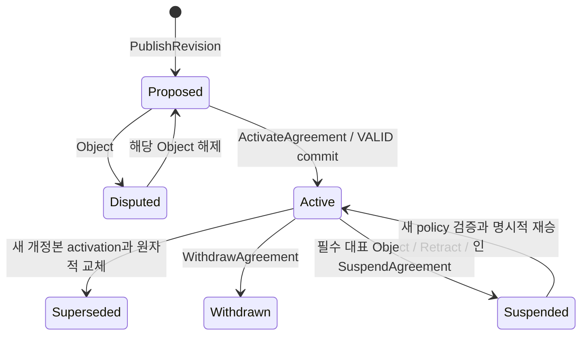

# 03. 지식 합의 프로토콜

## 의미 합의와 시스템 합의

업무적 합의는 domain owner가 해석·예외·경계·사용 범위를 채택하는 행위다. 시스템 합의는 signed command의 순서와 유효한 상태 변경을 노드들이 공유하는 과정이다. 개인/LLM의 주장, domain approval, peer endorsement, ordering finality는 서로 다른 기록이다.

## 핵심 객체

| 객체 | 의미 | 변경 방식 |
|---|---|---|
| Context | bounded context와 소유 역할 | 버전 관리된 governance command |
| DocumentRevision | 문서 본문과 context·부모·의존성을 묶은 불변 개정본 | 새 개정본 생성만 가능 |
| AgreementPolicy | 해당 slot의 필수 domain role·적용 규칙 | 새 policy version + 거버넌스 승인 |
| ApprovalDecision | 정확한 개정본/scope/policy/멤버십에 대한 approve/object/abstain/retract | 새 사건, 과거 결정은 보존 |
| Agreement | 해당 slot에서 활성화된 합의와 근거 | activate/supersede/withdraw/suspend |
| ReadFence | 현재 eligibility epoch를 순서화한 확인 지점 | nonce별 생성; 검색어는 기록하지 않음 |
| RunContextManifest | 실제로 공급한 지식 개정본과 당시 체크포인트 | 실행 조직에 보관하는 불변 기록 |

Schema와 payload 예제는 [schemas](../schemas/)와 [examples](../examples/)에 둔다. 예제는 unsigned payload이며 실제 서명·인가 증명이 아니다.

## 개정본과 본문

- 공유 payload는 전체 UTF-8 Markdown snapshot을 포함한다. delta/CRDT 기록은 초기 정본 형식에서 제외한다.
- `revision_digest = SHA-256(JCS(payload))`; digest wrapper 자신은 preimage에 포함하지 않는다. 문서 식별자·context·부모·참조·가시성·본문이 결속된다.
- 본문 수정, source revision 수정, context/scope 변경은 새 digest다. 기존 서명은 옛 개정본에 대해서만 유효하다.
- Unicode를 서명 후 정규화하거나 위키 렌더러가 본문을 재저장하지 않는다. authoring 단계의 newline LF 규약을 검사한다.
- 본문 링크나 첨부를 해시한다고 원문 보존이 되는 것은 아니다. 원장 내 본문과 외부 첨부의 보존 약속을 구분한다.
- 편집 협업은 private draft에서 Git/CRDT 등으로 처리할 수 있다. CRDT merge 성공을 업무 합의로 간주하지 않는다.

## 합의 slot과 정책

slot의 유일한 판정 키 `SlotKey`는 `(channel_id, document_id, context_id, scope_id, usage_scope)`다. `scope_id`는 workspace 안의 불변 업무 범위 ID이고 `usage_scope`는 의미가 고정된 버전 ID다. 모든 개정본·proposal·policy·decision·dependency·manifest·cache는 이 다섯 값에 결속한다. `acceptance_slot`은 표시/등록 별칭이며 판정 키를 대체하지 않는다. v1 revision은 단일 SlotKey에 결속된다. 다른 scope에서 재사용하려면 별도 문서/매핑 개정본이 원본을 참조한다. scope ID를 재사용해 의미를 바꾸지 않는다. 같은 slot의 active 개정본은 최대 하나다. 다른 context 또는 다른 usage scope의 active 해석은 공존한다.

v1 business policy는 **필수 역할마다 한 명의 지정 대표가 모두 승인**하는 `named_representatives`다. policy의 `role_representatives`는 role마다 정확히 한 `(actor_org_id, actor_id)`를 고정하고 `role_binding_version`의 ledger registry와 일치해야 한다. 같은 사람이 둘 이상의 필수 역할을 충족하는 것은 v1에서 금지한다. 여러 사람이 직책을 가지고 있어도 이 proposal의 대표를 자동으로 바꾸지 않는다. 대표 변경은 policy/binding 새 버전과 재승인을 요구한다.

최신 결정의 key는 `(proposal, policy_version, role, actor_id)`이며 원장 순서로 갱신한다. 필수 대표의 최신 상태가 approve인 경우에만 그 역할이 충족된다. 대표 외 기여자의 해석·이견은 기록하되 advisory이며 필수 대표의 결정을 덮어쓰지 않는다. n-of-m/다수결/다중 대표 모델은 v1에 없다.

Activation을 수행하는 chaincode는 policy/role registry/membership epoch가 현재인지 확인한다. 필수 조직을 줄이거나 소유자를 바꾸는 정책 변경은 해당 scope의 기존 소유 조직들의 governance 승인을 요구하며, 변경될 새 정책으로 자기 자신의 변경을 승인할 수 없다. 새 membership/policy version은 기존 미완료 approval을 승계하지 않는다.

## 검토 상태와 사용 상태

개정본의 검토 상태와 scope별 사용 상태를 별도로 조회한다.

| 상태/행위 | 의미 |
|---|---|
| private draft | 공유 전; 공용 원장에는 없음 |
| proposed | 공유된 불변 개정본, 검토 중 |
| disputed | 필수 역할에 미해결 object가 존재; 자동 activation 불가 |
| active | 해당 scope에서 정책 충족 후 VALID 커밋된 합의 |
| superseded | 새 active 개정본으로 대체된 과거 합의 |
| withdrawn | 책임자 요청에 따라 사용을 철회한 합의 |
| suspended | 키·정책·기밀 사고 등으로 사용을 보수적으로 정지 |

그림의 Proposed→Active는 **합의 view**의 전이이며 원문 객체를 수정하지 않는다. 철회/대체 이력은 삭제하지 않는다. 수정된 본문에는 반드시 새 개정본으로 의견을 다시 모은다.

## Proposal identity와 재승인

`proposal_id`는 channel 안에서 불변·유일한 검토 회차 ID다. 모든 ApprovalDecision의 서명 payload는 이 ID와 exact revision/SlotKey/policy/binding을 포함해야 하며 API route와 ledger target이 같아야 한다. `subject_id`나 본문 digest만으로 proposal identity를 대체하지 않는다.

정지 해제나 재승인이 필요하면 같은 본문이라도 **새 proposal_id**로 검토를 시작한다. ResumeAgreement는 새 proposal의 fresh 승인 집합을 참조한다. 기존 proposal의 서명을 다른 proposal에 복사할 수 없고, 같은 ID를 재개하면서 옛 approve를 재활성화하지 않는다. 옛 결정은 이력으로 남는다.

## 결정과 이의

- `approve`: 해당 revision/scope/policy에서 역할의 찬성 기록.
- `object`: 채택을 막는 사유와 필요한 수정·반례를 기록. v1의 필수 역할 object는 blocker다.
- `abstain`: 검토했으나 찬성하지 않음. required approval을 충족하지 않는다.
- `retract`: 자신의 이전 결정을 철회하는 새 사건. 오래된 결정의 bytes를 변경하지 않는다.
- 최신 결정은 지정 대표별로 계산한다. retract는 `retracts_decision_id`로 자신의 결정을 지정하며, 이전 approve를 되살리지 않고 유효 찬성 없음으로 만든다. 다시 찬성하려면 새 approve가 필요하다.
- active 이후 필수 대표의 object 또는 필수 approve의 retract는 **같은 transaction에서 agreement를 suspended로 만들고 eligibility_epoch를 증가**시킨다. 이후 object를 해제해도 자동 active로 복귀하지 않으며 ResumeAgreement의 새 승인 조건을 충족해야 한다.
- 과거 반대와 근거는 해당 문서를 볼 권한이 있는 사용자에게 보인다. 비공개 근거는 승인된 공개 요약·custodian attestation만 남긴다.

## 명령의 원자성

`ActivateAgreement`는 한 거래에서 다음을 읽고 검사한다.

1. revision payload와 digest, channel·slot 일치.
2. 현재 context owner/role registry, policy version, membership epoch.
3. policy가 요구하는 최신 approval, 미해결 필수 object 부재.
4. dependency revision/agreement가 지정한 scope에서 여전히 사용 가능한지.
5. `expected_active_agreement_id`와 현재 active slot의 일치.
6. idempotency command ID가 같은 payload에 사용됐는지.

모두 맞으면 새 agreement를 active로 만들고 이전 것을 superseded로 기록하며 `eligibility_epoch`를 증가시킨다. 동일 slot을 동시에 갱신하는 경쟁은 Fabric MVCC/CAS로 한쪽만 성공시킨다. 실패한 쪽은 현재 상태를 다시 조회하고 사용자에게 변경된 전제를 보여준다. 승인자의 의도를 자동으로 새 개정본에 이식하지 않는다.

## 멱등성과 커밋 불확실성

멱등성 범위는 `(channel, actor organization, command_id)`다. 같은 ID+같은 payload digest는 기존 transaction 상태를 반환하고, 다른 payload는 `IDEMPOTENCY_CONFLICT`다. 제출 timeout은 실패나 미기록을 뜻하지 않는다. 먼저 command/tx 상태를 조회하고 동일 command로 재시도한다. 새 ID로 무조건 재제출하지 않는다.

조직 API는 durable command-submission row/outbox에 payload digest와 **모든 시도 transaction ID**를 기록한다. 첫 커밋 전에는 같은 command의 재시도가 두 번째 tx ID를 만들 수 있다. 원장의 idempotency key는 동시에 제출한 거래 중 효과 하나만 유효하게 만들며, 뒤의 duplicate가 MVCC INVALID여도 첫 거래가 VALID면 command는 성공이다. `GET /commands`는 committed idempotency state를 최우선으로 조회하고, 아직 결과를 알 수 없는 시도가 있으면 unknown/pending을 유지한다. 하나의 실패 receipt만 보고 command 실패를 확정하지 않는다. outbox가 손실되면 원장 command key를 재조회한다.

Orderer ACK, transaction ID 발급, peer simulation 성공만으로 active를 표시하지 않는다. UI에는 pending/valid/invalid/unknown을 구분한다. INVALID 거래도 블록 내 payload에 남을 수 있으므로 민감 데이터 검사와 공유 승인은 제출 **이전**에 끝나야 한다.

## 의존성과 재검토

공동 규칙은 근거인 공유 revision digest와 사용 scope를 명시한다. 기본은 `requires_active` 의존성이다. 참고 문헌은 `informational`로 구분한다. active 의존성이 철회·정지·대체되면 파생 합의의 **effective eligibility**는 즉시 다음 Resolver 평가에서 false가 된다. 그래프 전체를 같은 거래에서 갱신하지 않는다. epoch를 올리고 Resolver가 의존성을 평가하며, projector가 영향을 받는 항목을 표시한다.

이력의 agreement 상태가 active로 남아 있어도 dependent-ineligible이면 규범적 조회에 포함하지 않는다. UI는 `재검토 필요`를 표시한다. dependency 순환은 게시/activation 때 거부하고, 깊이·개수 제한은 동일 policy config로 검증한다. 바뀐 근거에 대한 자동 재승인은 없다.

## 시간과 거버넌스

블록 순서는 실제 업무가 일어난 시간의 증명이 아니다. client timestamp는 주장된 작성 시점이며 authoritative ordering을 대체하지 않는다. expiry는 Resolver의 신뢰하는 서버 시간과 명시적 시계 오차 정책으로 검사한다. chaincode에서 외부 시각 API나 임의 wall clock을 호출하지 않는다. membership/key 사고는 `suspend`와 epoch 변경으로 처리한다.

거버넌스 비상 정지 역할은 사용을 줄일 수 있지만 합의를 새로 만들거나 기밀을 더 공개할 수 없다. 정지 해제와 권한 확대는 정상 승인 경로를 거친다. 보호하는 위협 모델과 한계는 [보안 설계](04-SECURITY.md)에 명시한다.
