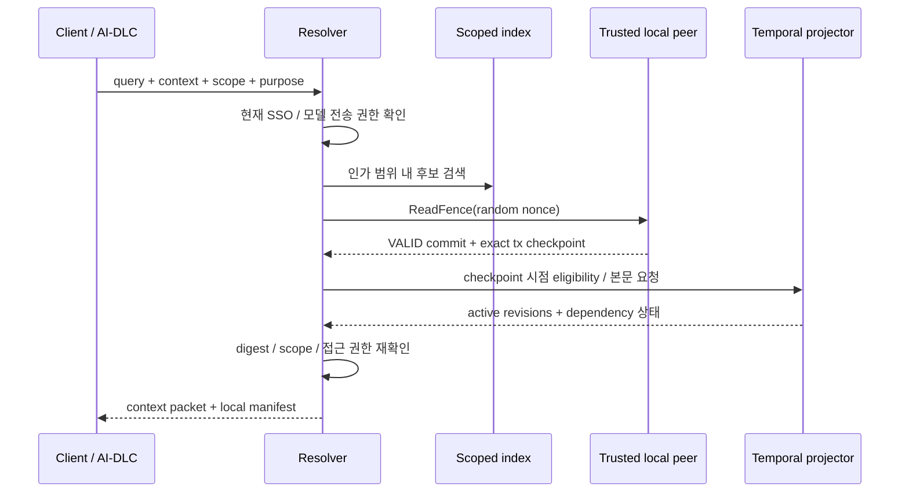

# 05. 맥락별 검색과 RAG

## 질의 모드

| 모드 | 용도 | 필요한 근거 |
|---|---|---|
| browse | 문서 탐색·이견 비교 | 현재 접근 권한 + 표시된 projection checkpoint |
| normative | 코드 생성·업무 규칙 적용 | 정확한 context/scope + VALID ReadFence + 유효한 agreement/dependencies |
| historical | 과거 판단 설명·재현 | 요청한 checkpoint와 당시 상태, 현재의 열람 권한 |

Historical 결과에는 `과거 기준 / 현재 실행 근거 아님`을 표시한다. Browse에서 disputed/proposed 문서를 읽는 것과 normative packet에 포함하는 것은 다른 동작이다. RAG의 합의 부재는 기본값 추정이나 유사도 1위 선택으로 메우지 않는다.

## 처리 흐름



벡터 인덱스는 후보를 찾는 도구다. 문서의 권위와 사용 가능 여부는 검증된 write-set 기반 temporal projection과 현재 접근 정책으로 판단한다. 본문 snippet은 정확한 source revision digest와 offset/section으로 추적한다. 의미 요약은 원문 인용과 구분하고, 요약 자체가 합의 문서로 쓰이려면 별도 revision 검토를 거친다.

## ReadFence 계약

`ReadFence`는 channel의 `eligibility_epoch`를 읽고 random nonce를 가진 fence receipt를 쓰는 거래다. 질의 텍스트, doc IDs, run ID, private refs를 transaction 인자로 보내지 않는다. 호출 조직의 service identity와 시점·빈도는 여전히 노출될 수 있다.

Epoch는 active 합의·정지·철회·대체·application policy/entitlement 등 **지식 사용 가능성이 바뀌는 모든 chaincode 전이**에서 같은 거래로 증가한다. 초안 텍스트 편집과 단순 읽기는 epoch를 올리지 않는다. 새로운 active 합의는 올린다.

Normative packet의 기준점은 다음이다.

```text
(channel_id, block_number, transaction_index, transaction_id, block_hash)
```

**같은 블록의 fence 뒤에도 다른 VALID 거래가 있을 수 있다.** 따라서 block 끝이 아니라 fence transaction 위치까지의 상태를 사용한다. Projector는 시간별 active interval/epoch 이력을 유지하고, 각 질의마다 최신 DB 전체를 과거로 rollback하지 않는다.

현재 웹 테스트 구현은 이 정확한 시점 조회를 유지하며, 응답 전에 더 최신 epoch를
이미 관측한 경우 추가로 제공을 보류한다. 보수적인 `FENCE_SUPERSEDED` 정책과
영속 이력은 [구현 결정](10-IMPLEMENTATION-DECISIONS.md) 및 [실행 가이드](12-FABRIC-WEB.md)에 기록한다.

Fence의 초기 유효 시간 후보는 요청 시작부터 30초다. 이는 ledger timestamp가 아니라 신뢰하는 gateway의 monotonic request deadline으로 검사한다. 재전송은 최초 요청 시각을 보존하며, deadline 이후 확인된 옛 fence를 새로운 작업에 재사용하지 않는다. 새 generation/action에는 새 nonce를 사용한다. 이 값은 P0 부하/복구 실험 후 조정한다.

Fence가 epoch를 읽은 뒤 선행 거래가 그 epoch를 바꾸면 fence는 MVCC invalid가 될 수 있다. 같은 nonce command의 결과를 확인하고 새로운 기준으로 제한된 재시도를 수행한다. peer commit receipt는 신뢰하는 local peer의 관측이며, Fabric SDK에 존재하지 않는 범용 quorum proof라고 부르지 않는다.

## 검색과 최신성의 한계

1. 인가된 범위에서 후보를 찾는다.
2. VALID fence를 얻는다. 불가하면 normative 응답을 `FRESHNESS_UNAVAILABLE`로 거부한다.
3. temporal projector가 정확한 fence tx까지 따라왔는지 확인한다. 뒤처지면 대기 한도 후 `PROJECTION_BEHIND`다.
4. 그 시점에 active이며 dependency 조건을 만족하는 개정본만 남긴다. 인덱스가 앞선 버전의 문서를 내놓아도 fence 시점에 유효하지 않으면 제외한다.
5. snapshot 후보 제한으로 현재 유효한 문서를 놓칠 수 있으므로, 필수 concept/document refs는 ledger eligibility 목록에서 직접 확인한다. 벡터 결과만으로 `지식 없음`을 확정하지 않는다.
6. 인용할 본문 digest와 정확한 revision metadata를 확인한다.
7. 반환 직전에 현재 SSO/access/model-egress 권한을 다시 확인한다. 권한 회수된 결과는 반환하지 않는다.

선형화 기준은 fence의 VALID commit이다. 이후의 철회가 이미 전달된 packet이나 실행된 부작용을 시간 역행하여 무효화하지 않는다. 연결 단절 때 즉시 철회 보장은 없으며, 새로운 strict 판단에는 fence를 얻어야 한다.

Fabric membership/외부 SSO 변경은 chaincode epoch와 자동 원자 결합되지 않는다. [보안 문서](04-SECURITY.md)의 serving freeze와 현재 SSO 검사 규칙을 적용한다.

## 이견·다의성과 응답

- context가 충분하면 그 context의 정의를 사용한다. 다른 context의 정의가 있다는 이유로 전체 작업을 중단하지 않는다.
- cross-context 작업에 필요한 mapping이 없거나 해당 scope가 disputed이면 차이와 미결 사항을 보여주고 clarification을 요청한다.
- private 근거만 있는 해석은 그 부서의 참고 주장으로 표시한다. 다른 조직이 원문을 검증한 전사 합의처럼 표시하지 않는다.
- Normative bundle과 참고자료를 구분해 전달한다. 관련성 높은 참고자료가 active 규칙을 암묵적으로 덮어쓰지 않도록 한다.
- 모든 텍스트는 tool/system permission을 바꾸는 명령이 아니라 입력 데이터다. 모델이 임의로 외부 도구 권한을 얻는 경로는 두지 않는다.

## 실행 manifest

실행 조직은 질의 목적, context/scope, 사용한 checkpoint, agreement/policy refs, 실제 **제공한** revision digest, chunk refs, private disclosure 범위, 인덱서/추출기/embedding 설정 버전을 로컬 manifest에 기록한다. 질의 원문·사용자 ID·private 문서 목록을 공용 원장에 올리지 않는다.

Manifest는 제공된 지식과 설정을 추적하는 자료다. 모델이 모든 토큰을 읽거나 이해했다는 증명, 동일 LLM 출력의 결정적 재현 보증은 아니다. query text와 원문을 로그에 남길지는 별도 부서 보존 정책으로 정한다.

## 부서 private 근거

Private vault는 부서가 권한과 immutable revision을 관리한다. 허용된 private 자료는 같은 부서의 실행에 참고자료로 공급할 수 있으나 shared agreement를 충족하는 증거로 자동 승격하지 않는다. private source ref는 로컬 manifest에만 남기고, common ledger의 ReadFence가 private vault의 최신성까지 보장한다고 주장하지 않는다. 원문과 snapshot 유지·접근 회수는 vault adapter의 별도 계약이다.

## 진행 중인 AI 작업

Agreement/dependency 변경 이벤트는 해당 source를 사용한 run을 `needs_revalidation`으로 표시한다. 이벤트가 유실돼도 다음 **외부 부작용 전** `/runs/{id}/revalidate`로 manifest에 결속된 전체 권한을 다시 확인한다. epoch 일치만으로 진행하지 않는다.

재검증 항목은 현재 SSO/session 유효성, application entitlement, channel config/serving freeze 정합성, 모든 private source의 snapshot 존재·현재 열람 권한·철회/최신성 정책, 현재 모델 endpoint 전송 정책, 실제 tool/action 대상에 대한 실행 권한, 마지막으로 fresh VALID fence다. 어느 하나라도 확인할 수 없으면 fail closed한다. Ledger epoch는 외부 SSO·private vault·tool 권한의 대체 수단이 아니다.

Private source가 철회되거나 재전송/실행 권한을 잃으면 그 자료를 포함한 run의 미공개 산출물은 보수적으로 withheld하고, 허용된 근거만으로 다시 생성·검토한다. 이미 생성된 파일/외부 부작용을 자동 삭제했다고 주장하지 않는다.

- 전체 외부 권한 재검증이 통과하고 epoch가 같으면 manifest 기준점 이후 ledger eligibility 변경이 없다는 조건에서 다음 단계로 진행한다.
- epoch가 다르면 정본을 재해석하고 영향을 받은 내용을 다시 생성/검토한다. MVP는 무관한 변경에도 보수적으로 재확인한다.
- 이미 실행 중인 모델 요청에서 지식 삭제를 약속하지 않는다. 취소 가능하면 취소하고, 산출물과 후속 tool command를 보류한다.
- Action 게이트는 새 fence 시점을 권한 판단의 기준으로 삼는다. 그 뒤에 발생한 철회와 외부 시스템 실행을 분산 transaction으로 원자화했다고 주장하지 않는다. 고위험 시스템은 자체 승인/철회 규약이 추가로 필요하다.

## 인덱싱·캐시·복구

캐시 키는 SlotKey=(channel_id, document_id, context_id, scope_id, usage_scope), revision digest, agreement-policy, application epoch, 권한 분류, 모델 전송 정책을 포함한다. 개별 사용자 ACL 결과를 다른 사용자에게 재사용하지 않는다. 철회 이벤트에서는 검색 제외와 cache eviction을 수행하되 correctness는 이벤트 수신만에 의존하지 않는다.

Doc body, Wiki projection, vector index, source-to-chunk mapping을 독립 재구축할 수 있어야 한다. projector cursor에는 block hash, tx index, reducer schema version을 저장한다. schema 변경·cursor 불일치 때 side-by-side replay 후 hash와 결과를 대조하고 교체한다.

구현된 벡터 검색(`/vector-search`)은 이 규칙을 따른다: 벡터 색인은 후보 제안기일 뿐이며 모든 후보는 요청 체크포인트의 검증된 원장 상태로 재검증되고, 필수 `document_ids`는 색인 없이 직접 해상된다. 응답의 `candidate_source`·`complete`는 후보 수집 범위만 알리므로 빈 색인 페이지를 지식 부재의 증거로 읽지 않는다. 외부 색인 모드에서 후보는 상위 200개로 제한되고, 페이지 커서는 첫 페이지의 순위 다이제스트 해시에 묶인다 — 페이지 사이 색인이 바뀌면 조용한 중복·누락 대신 `INVALID_CURSOR`로 첫 페이지부터 다시 받게 한다. 이 커서 계약은 설정한 임베더가 같은 입력에 같은 출력을 돌리는 결정적 함수라고 가정한다 — 비결정적 임베더는 페이지마다 순위가 흔들려 색인이 바뀌지 않아도 `INVALID_CURSOR`를 유발할 수 있다. 외부 색인 없이 외부 임베더만 설정한 derived-scan은 요청마다 검증 개정본을 전수 순회해 임베더를 호출하므로, 개정본 수가 임베딩 캐시 상한(1,000)을 넘는 배포는 외부 색인을 설정해야 한다. 세부 결정은 [구현 결정](10-IMPLEMENTATION-DECISIONS.md)에 기록했다.

## AI-DLC 연동

각 단계 시작 시 필요한 context/scope를 명시해 packet을 요청한다. shared knowledge를 프레임워크 파일에 직접 주입하거나 비공개 원문을 자동 수집하지 않는다. agent는 새로운 정의/수정이 필요하면 draft proposal을 만들고, domain owner의 합의를 기다린다. 기존 AI-DLC의 승인·도구 권한을 이 ledger가 대체한다고 가정하지 않는다. 이 제품의 책임은 지식의 선택·합의·버전 경계다.
