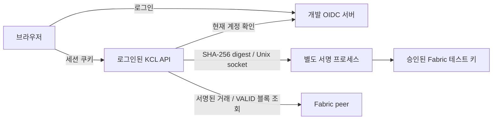

# 개발용 로그인과 별도 서명 서비스

운영 서비스 선택 없이 로그인·권한 회수·키 서비스 연결을 개발할 수 있는 기본 구성이다.
OIDC 로그인 서버는 `oidc-provider`, 애플리케이션 로그인 검증은 `openid-client`를 사용한다.
전자서명은 별도 프로세스가 승인된 Fabric 테스트 키로 수행한다.

## 바로 실행하기

Node 24 이상과 실행 중인 [Fabric 테스트 네트워크](../infra/fabric/README.md)가 필요하다.

```sh
npm ci --ignore-scripts
npm ci --prefix packages/fabric --ignore-scripts
npm ci --prefix packages/auth --ignore-scripts
npm run start:login
```

애플리케이션은 `http://127.0.0.1:4319`, 개발 로그인 서버는 `http://127.0.0.1:4320`이다.
앱의 **계정으로 로그인**을 누르고 개발 계정을 선택한다. 앱 안에서 승인자 역할을
임의로 바꾸는 메뉴는 없다. 다른 개발 계정으로 바꿀 때 로그인 서버의 계정 종료
확인 화면이 나타날 수 있다.

```sh
npm run start:login -- --port 4330 --issuer-port 4331 --data .data/login-other
```

기존 `npm start`와 `npm run start:fabric`는 명시적인 시뮬레이션/가상 역할 테스트다.
새 로그인 모드의 기본 데이터는 `.data/fabric-login`이며 기존 테스트 데이터를 덮어쓰지 않는다.

## 구성과 신뢰 경계



- 개발 로그인은 **비밀번호 없는 고정 테스트 계정 세 개**다. 실제 회사 계정 인증이 아니다.
  계정 상태, 토큰과 로그인용 키는 메모리에 두며 로그인 서버 재시작 시 초기화된다.
- 로그인 모드의 API 프로세스는 개인키 파일을 읽지 않는다. 서명 프로세스가
  `.data/fabric-smoke/crypto`의 승인된 User1 키만 읽고 공개 인증서와 키 쌍을 확인한다.
- 서명 채널은 소유자 전용 디렉터리 `0700`의 Unix socket `0600`이다. TCP 서명 포트는 없다.
  같은 OS 사용자로 실행하는 개발 구성이라 HSM·클라우드 KMS·조직별 강제 격리를 뜻하지 않는다.
- 개인키, 비밀번호, access/ID token은 Git·로그에 기록하지 않는다. 브라우저에는
  불투명 세션 쿠키와 CSRF 값만 전달하고 OIDC bearer token은 서버 메모리에 둔다.

## 로그인과 승인 규칙

Authorization Code + S256 PKCE를 사용한다. state는 브라우저 쿠키에 결속하고 일회용이며,
nonce·ID token 서명·issuer·audience·만료를 검증한다. 서명 검증은 TLS 경로에만 의존하지
않도록 명시적으로 활성화했다. HTTPS 제한 해제는 양 끝이 명시적인 loopback 개발 URL일 때만 허용한다.

승인자는 클라이언트가 보낸 actor/조직 claim으로 정하지 않는다. 서버가 관리하는
`(issuer, subject)` 바인딩으로 고정된 Fabric actor를 선택한다. 기본값은 다음과 같다.

| 개발 subject | Fabric 조직 | actor |
| --- | --- | --- |
| `dev-sales-owner` | `SalesMSP` | `person-sales-owner` |
| `dev-fulfillment-owner` | `FulfillmentMSP` | `person-fulfillment-owner` |
| `dev-settlement-owner` | `SettlementMSP` | `person-settlement-owner` |

요청 전후와 Gateway proposal/endorse/submit 직전에 현재 세션·계정 상태·바인딩을 다시 확인한다.
계정 비활성화, 권한 버전 변경, 로그아웃·만료는 새 작업을 거부한다. 응답 직전의 권한
검사 시간도 엄격한 컨텍스트 응답의 30초 유효 시간에 포함한다.

권한 회수로 실제 전송 전에 취소한 시도는 outbox `cancelled`로 보존하고 재조회하지 않는다.
실제 전송 뒤 결과가 불명확한 거래는 계속 복구한다. 전송 이후의 로그아웃이 이미 커밋된
거래를 소급 취소하지는 않는다. 채택된 지식의 철회는 별도 원장 명령으로 처리한다.

UserInfo 서버의 일시적 오류·429는 503으로 제공을 보류하면서 세션을 유지한다.
명시적인 인증 거부나 계정/권한 변경은 재로그인을 요구한다. 잘못되거나 빈 로그인
설정으로 실행하면 가상 역할 모드로 돌아가지 않고 시작 단계에서 실패한다.

## 검증

```sh
npm run check
npm run check:types
npm run demo
npm run auth:smoke
```

`auth:smoke`는 별도 서명 프로세스와 실제 OIDC/Fabric을 사용한다. 계정 비활성화·권한 버전
변경, endorsement 뒤 로그아웃으로 submit 차단, 취소 outbox 종료, 서명 서비스 정지→503→복구,
승인·철회를 확인한다. 새 가상 개정본을 만들며 마지막에 그 합의를 철회한다. 근거는
`.data/auth-smoke-*/auth-evidence.json`에 저장한다.

외부 SSO나 KMS로 전환할 때는 이 프로토콜·signer 인터페이스를 유지하면서 실제 계정 저장,
HTTPS 배포, 조직별 key 권한·vault와 운영 정책을 연결해야 한다. 현재 CLI는 loopback 개발용이다.

구현 참고: [openid-client](https://github.com/panva/openid-client),
[oidc-provider](https://github.com/panva/node-oidc-provider),
[Fabric Gateway signer](https://hyperledger.github.io/fabric-gateway/main/api/node/).
